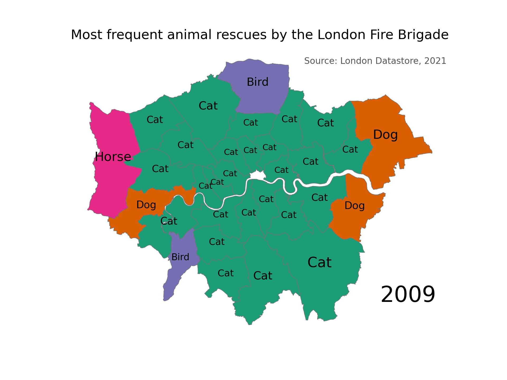

# choropleth_ldn
Simple script to create a chloropleth map of London with categorical timeseries data.

The script in `main.py` creates a gif of the most frequent animal types rescued by the London Fire Brigade over the
years, by borough. 
This is what that looks like:

It also performs some cleaning of the dataset, i.e.:
* removing boroughs that are not part of Greater London.
* replacing animal entries that are "Unknown - ..." e.g. "Unknown - Heavy Livestock Animal" to just "Unknown".

As a quick note, there are better ways to create gifs that don't involve saving down individual frames. However, I 
wanted to be able to look at the frames on their own as well.

## How to run
Install the required libraries by running `pip install -r requirements.txt` or `conda install --file requirements.txt`.

Create a folder called `fig`. This is where the script saves individual frames and the final gif.

Then run `main.py`.

## Data sources
London Fire Brigade Animal Rescue Dataset: https://data.london.gov.uk/dataset/animal-rescue-incidents-attended-by-lfb
(originally downloaded in 09/2021)

London Borough Map: https://data.london.gov.uk/dataset/statistical-gis-boundary-files-london

## Acknowledgements
Special thanks to Ben Dexter Cooley for his excellent articles on creating chloropleth maps and GIFs in python.

([article on maps](https://towardsdatascience.com/lets-make-a-map-using-geopandas-pandas-and-matplotlib-to-make-a-chloropleth-map-dddc31c1983d),
[article on gifs](https://towardsdatascience.com/how-to-make-a-gif-map-using-python-geopandas-and-matplotlib-cd8827cefbc8))
